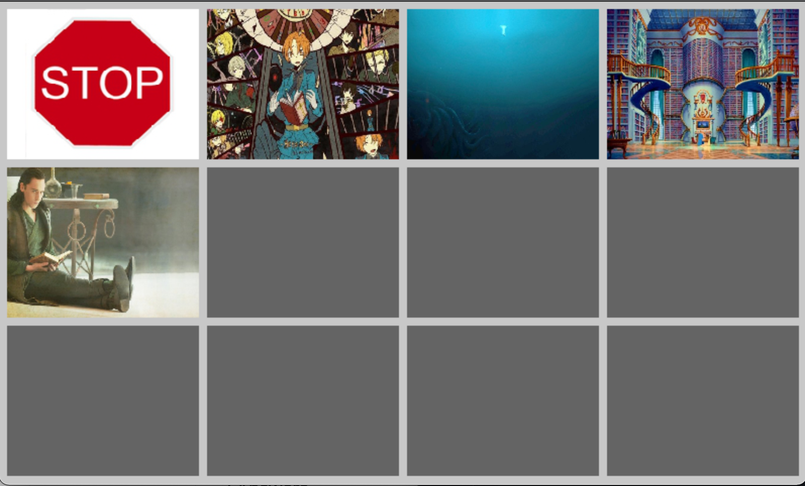

# ambient-mixer-sdl

This is a tool, initially written to work on a Raspberry Pi 3 with a Hyperpixel 4.0 Display (800*480px).
It takes presets and sounds from [ambient-mixer](https://www.ambient-mixer.com) (converted to ogg) and plays them with cross fade on switching. 

I wrote this to have a nice possibility to use it at my D&D table.





## Preparation

Folders and files:

```
presets/my-ambient.xml
images/my-ambient.jpg
sounds/1.ogg
sounds/2.ogg
```

Start the compiled tool:

```
build/src/sdlgame presets/my-ambient.xml [...]
```

To download it you can use the tool from [Philooz/pyambientmixer](https://github.com/Philooz/pyambientmixer)

## compile

```
make build
cd build
cmake ..
make -j
```
